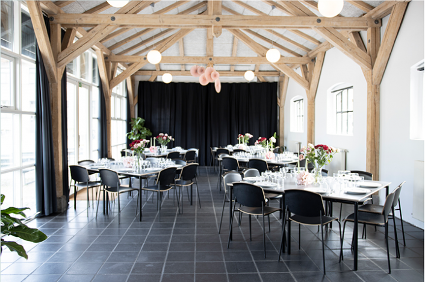
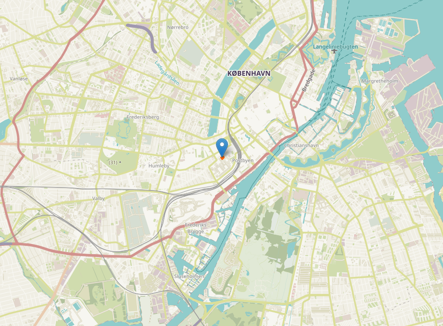
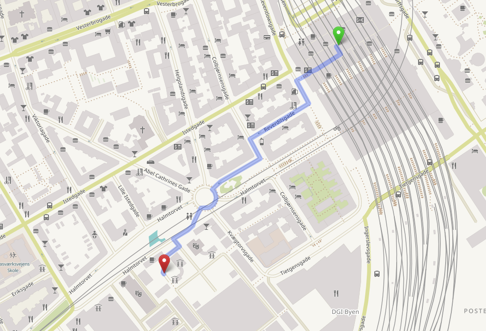

Django Day will be hosted at [Uncle Danny's Plaza (Onkel Dannys Plads)](https://onkeldannysplads.kk.dk/). It's a super central location owned by Copenhagen Municipality, offering direct access to the buzzling area of the "Meat packing district". The area is full of cafés and restaurants. If we are lucky with the spring weather, the outdoor area space next to the venue will make it possible to spend our breaks in the sun ☀️.

The venue will be transformed in the evening for a party 🎉 🥂 🍻

## Accessibility

The venue accommodates wheelchair access and is on ground level without any stairs. There are a few challenges, though:

* A 10 cm gap at the entrance
* Parking can be difficult because the area is busy
* A 76 cm wide entrance to toilets

You can read more details no the Danish website [godadgang.dk](https://godadgang.dk/faktaark/onkel-dannys-plads-forsamlingshuset-8326/data?filter=1). Please don't hesitate to get in touch with us for your needs! We are more than happy to accommodate you: [info@django-denmark.org](mailto:info@django-denmark.org)

## Location

 <small><a href="https://www.openstreetmap.org/?mlat=55.66984&amp;mlon=12.56052#map=20/55.66984/12.56052&amp;layers=H">View Larger Map</a></small>

## Getting there

The venue is a few hundred meets from Copenhagen Central station, where there are trains, metro and buses.

<small><a href="https://www.openstreetmap.org/directions?engine=fossgis_osrm_foot&route=55.67275%2C12.56466%3B55.66985%2C12.56072#map=17/55.67129/12.56136&layers=H">View Larger Map</a></small>
