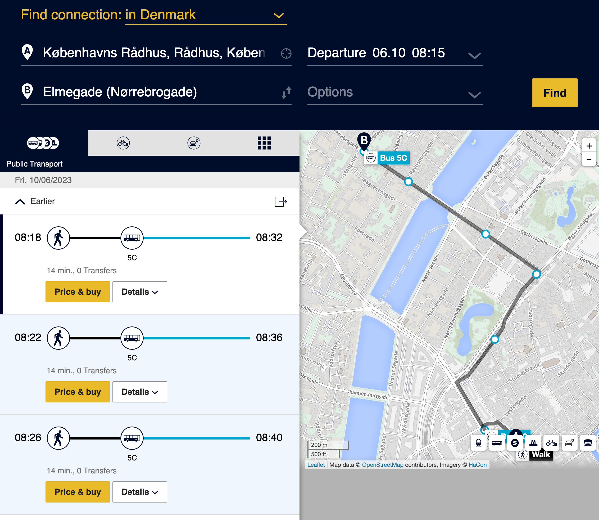

We are very happy to announce that Django Day Copenhagen will take place in the beautiful [Union](https://union.kk.dk/), located in Nørrebro Copenhagen.

The venue will be transformed in the evening for a party 🎉 🥂 🍻

## Accessibility

Please reach out to us if you have individual needs for attending.

Unfortunately, Union requires a trip up a staircase to the 1st floor.
There is no lift or elevator available.

## Location

Union 
Nørre Allé 7 
2200 Copenhagen N

<iframe width="425" height="350" frameborder="0" scrolling="no" marginheight="0" marginwidth="0" src="https://www.openstreetmap.org/export/embed.html?bbox=12.556782960891725%2C55.68994147615267%2C12.564207315444948%2C55.69318282025562&amp;layer=mapnik&amp;marker=55.69156218179477%2C12.560495138168335" style="border: 1px solid black"></iframe> <small><a href="https://www.openstreetmap.org/?mlat=55.69156&amp;mlon=12.56050#map=17/55.69156/12.56050">View Larger Map</a></small>

## Getting to CPH

### I'm arriving by train

You're likely to arrive at either Central Station (aka: "Hovedbanegården" or "København H") or Nørreport Station. Once there you can refer to the "Getting around CPH" section below.

### I'm flying into CPH

Copenhagen Airport aka "Kastrup Airport" is located 12 minutes away by train to the Central Station in Copenhagen's city centre. You need a ticket for 3 zones which can be purchased from one of the automated vending machines or the ticket counter inside the airport atrium. This costs DKK 36 for a single journey.

The Copenhagen Metro also connects Kastrup with central Copenhagen, with trains leaving every 4 minutes during the day and every 15 minutes at night, taking 14 minutes to the city centre. The ticket price is the same of DKK36.

The airport has different stations for mainline trains (Københavns Lufthavn, Kastrup Station) and for the metro (Lufthavnen Station), both are in Terminal 3. Another metro station is named Kastrup but has nothing to do with the airport although it is relatively close.

## Getting around CPH

The two big transport hubs are Central Station (aka: "Hovedbanegården" or "København H") with S-trains, intercity trains, the metro and buses, and Nørreport Station with S-trains, metro, regional trains and buses. Travel by train, bus and metro can be scheduled electronically through [rejseplanen.dk](https://rejseplanen.dk/).

### The CPH Zone system and tickets

The whole city, as well as the surrounding region is divided into fare zones. The range of a single zone can be roughly translated to around seven minutes in the Metro or fifteen minutes in a bus, but always check the zone maps in the stations, some stations are closer to zone borders than others

The number of available ticket types may be bewildering but if you're coming for the conference you should opt for the "single-ride" ticket.

The price of a single-ride ticket depends on the number of zones your travel through, the cheapest is the two-zone ticket which costs DKK 24 for adults (DKK 12 for children under the age of sixteen). This allows you to travel around Copenhagen in two zones; the zone where you stamped or purchased the ticket plus one adjacent zone.

You can travel for one hour starting from the time you stamp it. Within this hour you can switch freely between all trains, Metro, and buses. As long as your last trip starts before the time is up; your ticket will be timestamped in fifteen minute intervals.

### Getting to the venue

For example, let say you're staying close the Copenhagen City Hall ("Københavns Rådhus" in Danish). And you want to travel to [Union](https://union.kk.dk/) for Django Day CPH.

You try your luck with a Maps app, which allows you to discover that the closest bus stop to the venue is _Elmegade (Nørrebrogade)_.

Use this information on [rejseplanen.dk](https://rejseplanen.dk/), and you will see the options in more detail, including price:

And the ability to purchase the ticket itself!

You can filter the mode of transport you want. If the weather is nice and walking is an option to you, consider going on foot and exploring beautiful CPH!

### Purchasing tickets

For buses, tickets can be bought from the driver.

To purchase tickets at vending machines using debit/credit cards, **you will need to have a PIN code for your card**.

Otherwise, you will have to go to a manned [DSB](https://www.dsb.dk/en/) ticket desk, 7-Eleven kiosk, or download the [DOT Tickets app](https://dinoffentligetransport.dk/en/tickets/sales-outlets/dot-tickets-app/) app and purchase electronic tickets with that app.

### Useful links

* [Copenhagen Airport](https://www.cph.dk/en)
* [WikiVoyage - Copenhagen](https://en.wikivoyage.org/wiki/Copenhagen)
